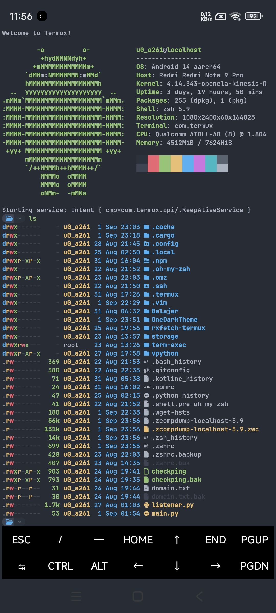
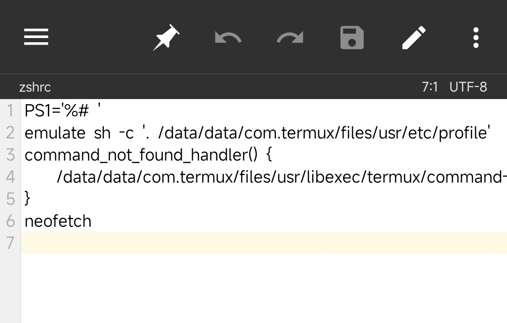

# One Dark Theme By Rendix (Repack) 
Kostum Tema untuk zsh termux.



# Penginstalan
Required :
- zsh (yang telah aktif) belum punya? lihat instalasi zsh [disini](https://ohmyz.sh/#install)
- eza
- git
- neofetch
- ncurses-utils


1. Clone github ini lalu masuk kedalam folder
2. salin perintah dibawah ini:
    ``` sh
    pkg in eza && pkg in git && pkg in neofetch && pkg in ncurses-utils
     ```
3. lalu install menggunakan perintah
    ``` sh
    dpkg -i "onedark.deb"
    ```
4. Exit dan buka kembali termux

Jika mengalami neofetch yang dipanggil berulang, coba pergi ke ``` /data/data/com.termux/files/usr/etc/zshrc ``` lalu jadikan seperti ini saja.



# Warning

Jika gagal menginstall dan menemukan masalah update dan upgrade pkg dengan packet ini, lakukan.

```sh
rm -rf /data/data/com.termux/files/usr/var/lib/dpkg/info/onedark*
```
```sh
dpkg --remove --force-remove-reinstreq onedark
```
